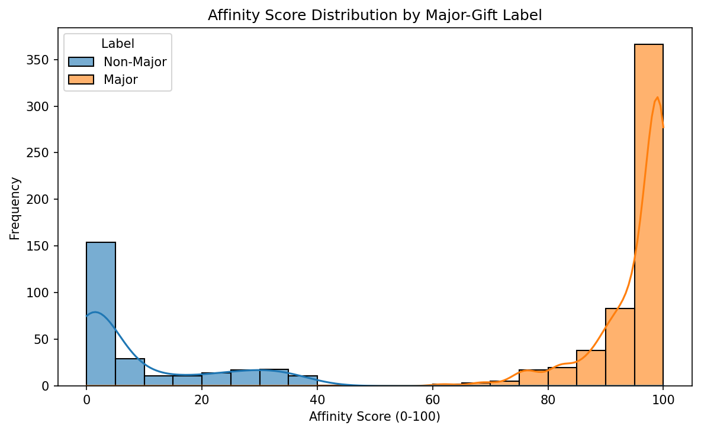

<p align="center">
  
</p>

<p align="center">
  <strong>PhilanthroPy: Code for a cause—predictive analytics for advancement teams.</strong>
</p>

<p align="center">
  <a href="https://pypi.org/project/philanthropy/"></a>
  
  <a href="https://github.com/PhilanthroPy-Project/PhilanthroPy/actions/workflows/ci.yml"></a>
  
  <a href="https://PhilanthroPy-Project.github.io/PhilanthroPy/"></a>
  <a href="LICENSE"></a>
</p>

<p align="center">
  <strong><a href="https://PhilanthroPy-Project.github.io/PhilanthroPy/">🚀 View the Full Documentation Site</a></strong>
</p>

---

## What is PhilanthroPy?

PhilanthroPy is a production-ready Python library that slots directly into `sklearn.pipeline.Pipeline`. It covers the full predictive workflow for nonprofit and academic medical center (AMC) fundraising — from raw CRM cleaning and wealth imputation to major-gift propensity scoring, lapse prediction, and planned-giving intent.

---

## Installation

```bash
pip install philanthropy
```

<details>
<summary>From source (for development)</summary>

```bash
git clone https://github.com/PhilanthroPy-Project/PhilanthroPy.git
cd PhilanthroPy
pip install -e ".[dev]"
```

Or with Conda:
```bash
conda env create -f environment.yml && conda activate Philanthropy
pip install -e ".[dev]"
```
</details>

---

## Quick Start

```python
from philanthropy.datasets import generate_synthetic_donor_data
from philanthropy.models import DonorPropensityModel

df = generate_synthetic_donor_data(n_samples=500, random_state=42)
X = df[["total_gift_amount", "years_active", "event_attendance_count"]].to_numpy()
y = df["is_major_donor"].to_numpy()

model = DonorPropensityModel(n_estimators=200, random_state=0)
model.fit(X, y)
scores = model.predict_affinity_score(X)   # 0–100 affinity scale
```

> **Runnable scripts:** [`examples/quickstart.py`](examples/quickstart.py) and [`examples/unischema_to_scores.py`](examples/unischema_to_scores.py) run end to end and are smoke-tested in CI.

<p align="center">
  
  <br/>
  <em>Output of <code>plot_affinity_distribution()</code>: the 0–100 affinity scores cleanly separate major from non-major donors.</em>
</p>

---

## From UniSchema events to scores

PhilanthroPy is the modeling half of an ecosystem. [UniSchema](https://github.com/PhilanthroPy-Project/UniSchema) normalizes fragmented advancement webhooks (GiveCampus, Slate, NPSP, Cvent, …) into a single `ConstituentEvent` stream. `philanthropy.ingest` turns that stream into the donor-level feature table the estimators expect — no glue code between the two projects:

```python
from philanthropy.ingest import read_constituent_events, constituent_events_to_features
from philanthropy.models import DonorPropensityModel

# 1. Load whatever UniSchema egressed — a .ndjson batch, a .json file, or a directory
events = read_constituent_events("data/egress/")

# 2. Aggregate to one row per donor — columns match the Quick Start above
features = constituent_events_to_features(events)

# 3. Score with a model trained on your labelled giving history (X_train, y_train).
#    Runnable end-to-end version: examples/unischema_to_scores.py
X = features[["total_gift_amount", "years_active", "event_attendance_count"]].to_numpy()
model = DonorPropensityModel(n_estimators=200, random_state=0).fit(X_train, y_train)
features["affinity_score"] = model.predict_affinity_score(X)
```

`constituent_events_to_features` is **leakage-safe** (recency anchored to an explicit `reference_date` or the batch's latest event, never a moving "now") and **at-least-once-safe** (deduplicates redelivered webhooks by `eventId`). Output, one row per constituent indexed by `constituent_id`:

| Column | Built from |
|---|---|
| `total_gift_amount`, `gift_count`, `first_gift_date`, `last_gift_date` | `DONATION` events |
| `event_attendance_count` | `EVENT_REGISTRATION` events |
| `email_click_count` | `EMAIL_CLICK` events |
| `years_active`, `recency_days` | first / last event vs. reference date |
| `distinct_source_systems` | channel breadth |

---

## Feature Overview — v0.4.0

### 🧹 Preprocessing

| Transformer | Description |
|---|---|
| `CRMCleaner` | Standardise raw CRM exports — coerce types, strip whitespace, drop PII columns |
| `WealthScreeningImputer` | Leakage-safe wealth imputation (median / mean / zero) with optional missingness indicator columns; fill stats frozen at `fit()` time |
| `WealthPercentileTransformer` | Per-column wealth percentile rank (0–100); NaN-in → NaN-out |
| `FiscalYearTransformer` | Fiscal year & quarter features from gift dates; configurable fiscal year start month |
| `RFMTransformer` | Recency–Frequency–Monetary value feature engineering for donor segmentation |
| `EncounterTransformer` | Bridge hospital EHR encounter records with philanthropy CRM; computes `days_since_last_discharge` and `encounter_frequency_score`; snapshot at `fit()` prevents leakage |
| `GratefulPatientFeaturizer` ⭐ **NEW** | Clinical gravity score + AMC service-line capacity weights (cardiac 3.2×, oncology 2.9×, neuroscience 2.7×); outputs `clinical_gravity_score`, `distinct_service_lines`, `distinct_physicians`, `total_drg_weight` |
| `DischargeToSolicitationWindowTransformer` ⭐ **NEW** | Post-discharge solicitation window flags tracking recency; outputs `in_solicitation_window` (0/1), `window_position_score` (1.0 at midpoint, 0.0 at edges), and `discharge_recency_tier` (int 0-4); NaN → 0 |
| `PlannedGivingSignalTransformer` ⭐ **NEW** | Bequest / legacy-gift intent vector: `is_legacy_age`, `is_loyal_donor`, `inclination_score` (−1 sentinel for absent data), `composite_score` [0–3] |

### 🤖 Models

| Model | Description |
|---|---|
| `DonorPropensityModel` | Random Forest classifier with `predict_affinity_score()` returning a 0–100 scale |
| `MajorGiftClassifier` | Calibrated `HistGradientBoostingClassifier` — NaN-native, with `predict_affinity_score()` |
| `ShareOfWalletRegressor` | Estimates total giving capacity and untapped-potential ratio |
| `LapsePredictor` | Random Forest classifier for donor lapse; see full docs below |
| `MovesManagementClassifier` | Multi-class portfolio stage predictor |
| `PropensityScorer` | Constant-probability baseline (P=0.5) — a floor to beat; use `DonorPropensityModel` for real scoring |
| `PlannedGivingIntentScorer` ⭐ **NEW** | Wraps GradientBoostingClassifier to predict bequest intent scores (0-100 scale) |
| `FinancialForecastModel` ⭐ **NEW** | Hybrid LSTM-ARIMA revenue/giving forecaster with `predict_revenue_forecast(X, horizon)`; leakage-safe, dependency-free, sklearn-native |

### 🔀 Model Selection

| Splitter | Description |
|---|---|
| `FiscalYearGroupedSplitter` ⭐ **NEW** | Walk-forward cross-validator preventing fiscal year data leakage |

### 📊 Metrics

| Function | Description |
|---|---|
| `donor_lifetime_value` | LTV with configurable discount rate |
| `retention_rate` | Period-over-period donor retention |
| `donor_acquisition_cost` | CAC from campaign spend data |

### 🗂 Datasets

| Function | Description |
|---|---|
| `generate_synthetic_donor_data` | Reproducible synthetic prospect pool — `n_samples`, `random_state` |

### 🔌 Ingest ⭐ **NEW**

| Function | Description |
|---|---|
| `constituent_events_to_features` | Aggregate a UniSchema `ConstituentEvent` stream into a one-row-per-donor feature table; leakage-safe, deduplicates by `eventId` |
| `read_constituent_events` | Load UniSchema's JSON / NDJSON / directory egress into a list of event dicts |

---

### DischargeToSolicitationWindowTransformer

Post-discharge solicitation window featurization. Flags donors within the optimal window (days post-discharge) and emits proximity scores.

| Parameter               | Type | Default | Description                    |
|-------------------------|------|---------|--------------------------------|
| min_days_post_discharge | int  | 90      | Start of solicitation window   |
| max_days_post_discharge | int  | 365     | End of solicitation window     |
| days_since_discharge_col| str  | "days_since_last_discharge" | Column name for days since discharge |

**Output columns:** `in_solicitation_window` (0/1), `window_position_score` [0,1], `discharge_recency_tier` [0–4].

---

### LapsePredictor

Production Random Forest classifier for donor lapse risk. Predicts whether a donor will lapse within a configurable window.

| Parameter       | Type                 | Default | Description                |
|-----------------|----------------------|---------|----------------------------|
| n_estimators    | int                  | 100     | Number of trees            |
| max_depth       | int or None          | None    | Maximum tree depth         |
| min_samples_leaf| int                  | 1       | Min samples per leaf       |
| class_weight    | dict/"balanced"/None | None    | Class weighting            |
| lapse_window_years | int               | 2       | Prediction window in years |
| random_state    | int or None          | None    | Reproducibility seed       |

**Fitted attributes**

| Attribute   | Description                            |
|-------------|----------------------------------------|
| estimator_  | Trained RandomForestClassifier         |
| classes_    | Array of class labels                  |
| n_features_in_ | Feature count from fit              |

**Methods**

| Method               | Returns         | Description                               |
|----------------------|-----------------|-------------------------------------------|
| .fit(X, y)           | self            | Train on features and binary lapse label  |
| .predict(X)          | ndarray (n,)    | Binary predictions (1 = at-risk)          |
| .predict_proba(X)    | ndarray (n,2)   | Class probabilities                       |
| .predict_lapse_score(X) | ndarray (n,) | P(lapse) × 100, range [0.0, 100.0]        |

```python
from philanthropy.models import LapsePredictor

predictor = LapsePredictor(
    n_estimators=200,
    lapse_window_years=3,
    class_weight="balanced",
    random_state=42,
)
predictor.fit(X, y)
at_risk = predictor.predict(X)           # 1 = at risk of lapsing
scores  = predictor.predict_lapse_score(X)  # 0–100 lapse risk score
```

---

### MajorGiftClassifier

Calibrated gradient-boosted classifier for major-gift propensity. Uses HistGradientBoostingClassifier wrapped in CalibratedClassifierCV for well-calibrated probabilities on skewed datasets. Handles NaN values natively — no upstream imputation needed.

| Parameter     | Type          | Default | Description           |
|---------------|---------------|---------|-----------------------|
| learning_rate | float         | 0.1     | Boosting step size    |
| max_iter      | int           | 100     | Number of boosting trees |
| max_depth     | int or None   | None    | Maximum tree depth    |
| random_state  | int or None   | None    | Reproducibility seed  |

**Fitted attributes**

| Attribute     | Description                                                         |
|---------------|---------------------------------------------------------------------|
| estimator_    | CalibratedClassifierCV wrapping HistGradientBoostingClassifier      |
| classes_      | Array of class labels                                               |
| n_features_in_ | Feature count from fit                                            |

**Methods**

| Method                    | Returns       | Description                                         |
|---------------------------|---------------|-----------------------------------------------------|
| .fit(X, y)                | self          | Train model                                         |
| .predict(X)               | ndarray (n,)  | Binary predictions                                  |
| .predict_proba(X)         | ndarray (n,2) | Calibrated probabilities (rows sum to 1.0)          |
| .predict_affinity_score(X) | ndarray (n,) | P(major gift) × 100, integer, range [0, 100]        |

> **Key distinction from DonorPropensityModel:** DonorPropensityModel uses Random Forest with raw probabilities and float affinity scores. MajorGiftClassifier uses HistGradientBoosting + calibration, handles NaN natively, produces integer affinity scores, and provides better-calibrated probabilities on skewed datasets.

```python
from philanthropy.models import MajorGiftClassifier
import numpy as np

model = MajorGiftClassifier(max_iter=200, random_state=42)
model.fit(X, y)

# Works with NaN values — no upstream imputation needed
X_with_nan = X.copy().astype(float)
X_with_nan[0, 1] = np.nan
scores = model.predict_affinity_score(X_with_nan)
```

---

### PlannedGivingIntentScorer

Bequest/planned giving intent classifier. GradientBoostingClassifier + CalibratedClassifierCV for calibrated probabilities.

| Parameter     | Type          | Default | Description           |
|---------------|---------------|---------|-----------------------|
| n_estimators  | int           | 100     | Boosting stages       |
| random_state  | int or None   | None    | Reproducibility seed  |

**Methods:** `.fit(X, y)`, `.predict(X)`, `.predict_proba(X)`, `.predict_intent_score(X)` — P(intent) × 100, [0.0, 100.0].

---

### FinancialForecastModel

Hybrid **LSTM-ARIMA** revenue/giving forecaster. Decomposes a giving series into a linear (ARIMA-surrogate) component fitted with `LinearRegression` and a nonlinear (LSTM-surrogate) residual component fitted with `MLPRegressor` — reproducing the additive hybrid `y = linear(X) + nonlinear_residual(X)` with **no heavy dependencies** (no TensorFlow / statsmodels). Multi-step forecasts roll a frozen autoregressive model forward. All fitted statistics (fill values, sub-models, AR coefficients) are frozen at `fit()` for leakage safety.

| Parameter          | Type          | Default | Description                                    |
|--------------------|---------------|---------|------------------------------------------------|
| ar_order           | int           | 3       | Order of the autoregressive roll-forward       |
| hidden_layer_sizes | tuple         | (64,)   | Residual network architecture (LSTM stand-in)  |
| max_iter           | int           | 300     | Max optimisation iterations for the network    |
| alpha              | float         | 1e-4    | L2 regularisation of the residual network      |
| random_state       | int or None   | None    | Reproducibility seed                           |

**Methods:** `.fit(X, y)`, `.predict(X)` → ndarray (n,), `.predict_revenue_forecast(X, horizon)` → ndarray (horizon,).

```python
from philanthropy.models import FinancialForecastModel

model = FinancialForecastModel(ar_order=3, random_state=42)
model.fit(X, y)                                   # y = period giving revenue
forecast = model.predict_revenue_forecast(X, horizon=4)   # next 4 periods
```

---

### API quick reference

| Component                          | Module                    | Type        |
|------------------------------------|---------------------------|-------------|
| DonorPropensityModel               | philanthropy.models       | Classifier  |
| MajorGiftClassifier                | philanthropy.models       | Classifier  |
| LapsePredictor                     | philanthropy.models       | Classifier  |
| PlannedGivingIntentScorer          | philanthropy.models       | Classifier  |
| ShareOfWalletRegressor             | philanthropy.models       | Regressor   |
| FinancialForecastModel             | philanthropy.models       | Regressor   |
| DischargeToSolicitationWindowTransformer | philanthropy.preprocessing | Transformer |
| RFMTransformer                     | philanthropy.preprocessing | Transformer |

---

## sklearn Pipeline Example

```python
from sklearn.pipeline import Pipeline
from philanthropy.preprocessing import (
    FiscalYearTransformer, WealthScreeningImputer, DischargeToSolicitationWindowTransformer
)
from philanthropy.models import DonorPropensityModel

pipe = Pipeline([
    ("fy",      FiscalYearTransformer(date_col="gift_date")),
    ("wealth",  WealthScreeningImputer(wealth_cols=["estimated_net_worth"])),
    ("window",  DischargeToSolicitationWindowTransformer()),
    ("model",   DonorPropensityModel(n_estimators=200, random_state=0)),
])
pipe.fit(X_train, y_train)
scores = pipe.predict_proba(X_test)[:, 1]
```

---

## Package Overview

```
philanthropy/
├── ingest/
│   └── _constituent_events.py   # UniSchema ConstituentEvent → donor features
├── datasets/
│   └── _generator.py
├── preprocessing/
│   ├── transformers.py
│   ├── _wealth.py
│   ├── _wealth_percentile.py
│   ├── _encounters.py
│   ├── _encounter_recency.py
│   ├── _rfm.py
│   ├── _discharge_window.py
│   ├── _solicitation_window.py   # alias → _discharge_window
│   ├── _grateful_patient.py
│   ├── _planned_giving.py
│   └── _share_of_wallet.py
├── models/
│   ├── propensity.py
│   ├── _propensity.py
│   ├── _wallet.py
│   ├── _lapse.py
│   ├── _planned_giving.py
│   ├── _moves.py
│   └── _forecast.py
├── metrics/
│   ├── scoring.py
│   └── _financial.py
├── model_selection/
│   └── __init__.py
├── experimental/
│   └── _lapse.py
├── visualisation/
│   └── _plots.py
└── utils/
    ├── testing.py
    └── _validation.py
```

---

## Medical Philanthropy Pipeline

```python
from sklearn.compose import ColumnTransformer
from sklearn.pipeline import Pipeline
from philanthropy.preprocessing import EncounterTransformer, CRMCleaner

# 1. EHR data extraction
encounter_features = EncounterTransformer(
    encounter_df=encounter_df,
    encounter_date_col="discharge_date",
    donor_id_col="mrn"
)

# 2. Use ColumnTransformer to merge EHR features with numeric CRM data
# This prevents the silent dropping of original CRM columns like estimated_net_worth
preprocessor = ColumnTransformer(
    transformers=[
        ("encounters", encounter_features, ["mrn", "gift_date"]),
        ("crm_nums", CRMCleaner(), ["estimated_net_worth", "real_estate_value"]),
    ],
    remainder="passthrough"
)

# 3. Fit pipeline on original dataset (gift_df)
gift_features = preprocessor.fit_transform(gift_df)
```

---

## Testing

**1160 tests** across 26 files — `check_estimator` compliance for every public
estimator, property-based (Hypothesis) suites, and a dedicated temporal-leakage
suite.

```bash
# Full suite
pytest tests/ -q

# sklearn check_estimator compliance
pytest tests/test_sklearn_compliance.py -q

# Property-based (Hypothesis)
pytest tests/test_properties.py tests/test_preprocessing_properties.py -q

# Leakage prevention
pytest tests/test_leakage.py -v
```

---

## Roadmap

### ✅ Completed

- CRMCleaner — leakage-safe CRM standardisation
- WealthScreeningImputer — median/mean/zero imputation
- EncounterTransformer — clinical discharge → feature engineering
- RFMTransformer — Recency, Frequency, Monetary features
- DischargeToSolicitationWindowTransformer — solicitation window features
- ShareOfWalletRegressor — capacity regression + predict_capacity_ratio()
- MajorGiftClassifier — gradient-boosted with calibrated probabilities
- LapsePredictor — production RF with predict_lapse_score()
- PlannedGivingIntentScorer — planned giving intent classifier
- donor_lifetime_value() — NPV LTV with discount rate
- philanthropy.visualisation — affinity score plots
- Property-based Hypothesis testing for FiscalYearTransformer
- Temporal leakage prevention test suite
- GitHub Actions CI (Python 3.10 + 3.11 matrix)
- Coverage gate (≥ 85%)
- Makefile (make ci)
- Branch protection + PR workflow
- `philanthropy.ingest` — UniSchema `ConstituentEvent` → donor feature bridge
- MkDocs Material documentation site (GitHub Pages)
- PyPI release (`pip install philanthropy`)
- `philanthropy.visualisation.plot_retention_waterfall()`

### 🔜 Next

- `philanthropy.visualisation.plot_capacity_heatmap()`
- `EnsemblePropensityModel` (stacked LapsePredictor + DonorPropensityModel)

---

## Design Principles

- **Leakage-safe by design** — fill statistics, encounter summaries, and encounter snapshots are all frozen at `fit()` time; `transform()` is fully idempotent
- **sklearn-native** — all estimators pass `check_estimator`; support `set_output(transform="pandas")`, `clone()`, `get_params()` / `set_params()`
- **NaN-transparent** — wealth and clinical transformers declare `allow_nan = True`; no silent data loss
- **PII-aware** — `EncounterTransformer` auto-drops PII-like columns before returning features

---

## Contributing

See **[CONTRIBUTING.md](CONTRIBUTING.md)** for the full local test gate, the
new-test-file workflow, and pre-push hook setup. In short: run `make ci` before
every push, and never use `git push --no-verify`.

---

## License

MIT License — see `LICENSE` for details.