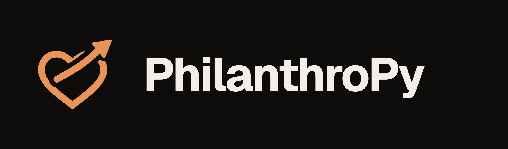
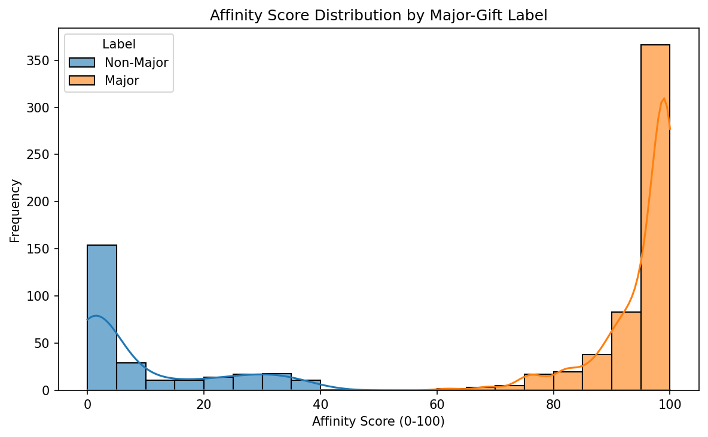

<p align="center">
  
</p>

<p align="center">
  <strong>Rank your donors by who is most likely to make a major gift: leakage-safe scikit-learn models for nonprofit and hospital fundraising.</strong>
</p>

<p align="center">
  <a href="https://pypi.org/project/philanthropy/"></a>
  
  <a href="https://github.com/PhilanthroPy-Project/PhilanthroPy/actions/workflows/ci.yml"></a>
  
  
  <a href="https://PhilanthroPy-Project.github.io/PhilanthroPy/"></a>
  <a href="LICENSE"></a>
</p>

<p align="center">
  <strong><a href="https://PhilanthroPy-Project.github.io/PhilanthroPy/">🚀 View the Full Documentation Site</a></strong>
</p>

---

## What is PhilanthroPy?

PhilanthroPy is a Python library that slots directly into `sklearn.pipeline.Pipeline`. It covers the full predictive workflow for nonprofit and academic medical center (AMC) fundraising, from raw CRM cleaning and wealth imputation to major-gift propensity scoring, lapse prediction, and planned-giving intent.

### Who it's for

One toolkit, two audiences:

- **General nonprofit & university advancement teams** (no PHI in scope): CRM cleaning, RFM segmentation, wealth-screening imputation, and donor-propensity / lapse / planned-giving scoring. Start with `CRMCleaner`, `RFMTransformer`, `WealthScreeningImputer`, and `DonorPropensityModel`.
- **Academic medical center (AMC) foundations running grateful-patient programs** (PHI in scope, higher scrutiny): clinical-encounter featurization via `EncounterTransformer`, `GratefulPatientFeaturizer`, and `DischargeToSolicitationWindowTransformer`. **Before production use, read [Compliance Considerations](docs/explanation/compliance_considerations.md):** the PII handling here is a name-based heuristic, *not* formal HIPAA de-identification.

### Maturity

Single-maintainer MIT project. **`pip install philanthropy` gives you `0.7.0`**, the current release.

`main` is ahead of it: `1.0.0` (freezes the API) is merged and green but deliberately unreleased, so 0.7.0 gets a real usage window before that promise takes effect. Read the [CHANGELOG](CHANGELOG.md) for what is queued.

Preprocessing and the core classifiers are Tier 1; grateful-patient featurization and `philanthropy.ingest` are Tier 2 (Beta); `FinancialForecastModel` and `philanthropy.experimental.*` are Tier 3 (Experimental) and carry no API guarantees. From `1.0.0`, Tier 1 becomes semver-protected: breaking one requires a major release preceded by a full published minor of `DeprecationWarning`. Per-symbol tiers are in the [API reference](docs/reference/index.md).

> **Maintenance:** maintained by one person on a best-effort basis. For vendor / OSS risk reviews: the bus factor is 1.

---

## Installation

```bash
pip install philanthropy
```

<details>
<summary>From source (for development)</summary>

```bash
git clone https://github.com/PhilanthroPy-Project/PhilanthroPy.git
cd PhilanthroPy
pip install -e ".[dev]"
```
</details>

---

## Quick Start

```python
import pandas as pd
from sklearn.metrics import roc_auc_score
from sklearn.model_selection import train_test_split

from philanthropy.datasets import generate_synthetic_donor_data
from philanthropy.models import DonorPropensityModel

df = generate_synthetic_donor_data(n_samples=2000, random_state=42)
X = df[["total_gift_amount", "years_active", "event_attendance_count"]].to_numpy()
y = df["is_major_donor"].to_numpy()

# Split BEFORE fitting. Scoring the rows you trained on tells you nothing.
X_train, X_test, y_train, y_test = train_test_split(
    X, y, test_size=0.25, stratify=y, random_state=42
)

model = DonorPropensityModel(n_estimators=200, random_state=0)
model.fit(X_train, y_train)

scores = model.predict_affinity_score(X_test)   # 0–100, not a raw probability
auc = roc_auc_score(y_test, model.predict_proba(X_test)[:, 1])

print(f"held-out ROC-AUC: {auc:.3f}")
print(pd.Series(scores).groupby(y_test).describe()[["count", "mean", "min", "max"]])
```

```
held-out ROC-AUC: 0.841
   count       mean  min    max
0  317.0  22.069401  0.0   96.0
1  183.0  58.704918  1.0  100.0
```

Held-out ROC-AUC 0.841, and the score distributions **overlap**: some non-major
donors score 96 and some major donors score 1. Ranking works, separation is not
clean, and a call list cut at any single threshold will contain mistakes. Pick
the threshold from your team's capacity, not from this table.

> An earlier version of this section fitted and scored the *same* rows and
> reported a clean gap ("non-major donors top out at 39, no major donor below
> 65"). That gap was a random forest reciting its training set, since RF leaves
> go pure and `predict_affinity_score` is `predict_proba(X)[:, 1] * 100`. It also
> ran on a generator that drew the gift amount *from* the label, which inflated
> every number; that is fixed, and these figures come from the corrected
> data-generating process. They are still synthetic: see
> [Benchmarks](docs/explanation/benchmarks.md).

> **Try it now, zero install:** [](https://colab.research.google.com/github/PhilanthroPy-Project/PhilanthroPy/blob/main/examples/quickstart.ipynb)
>
> **Runnable scripts:** [`examples/quickstart.py`](examples/quickstart.py) and [`examples/unischema_to_scores.py`](examples/unischema_to_scores.py) run end to end and are smoke-tested in CI.

<p align="center">
  
  <br/>
  <em>Output of <code>plot_affinity_distribution()</code>: the 0-100 affinity scores separate the two groups on average, with tails that overlap. Ranking works; a single clean cut point does not exist.</em>
</p>

### Using PhilanthroPy from R

Advancement analytics has been an R-first field for years, so PhilanthroPy
also works from R through [`reticulate`](https://rstudio.github.io/reticulate/):

```r
library(reticulate)
datasets <- import("philanthropy.datasets")
models   <- import("philanthropy.models")

df <- datasets$generate_synthetic_donor_data(n_samples = 1000L, random_state = 0L)
X  <- as.matrix(df[c("total_gift_amount", "years_active", "event_attendance_count")])
y  <- df$is_major_donor

model  <- models$DonorPropensityModel(n_estimators = 100L, random_state = 0L)
model$fit(X, y)
scores <- model$predict_affinity_score(X)   # 0-100 affinity scores
```

> **Note the `L` suffixes.** `reticulate` passes bare R numerics as doubles,
> and scikit-learn rejects floats wherever an integer is expected
> (`n_samples`, `random_state`, ...). Write `1000L`, not `1000`, or the call
> dies inside sklearn's parameter validation with a confusing type error.

### No Python? Use the CLI

`pip install philanthropy` also puts a `philanthropy` command on your PATH. CSV in, scored CSV out, no Python file to write.

```bash
philanthropy train --data gifts.csv --target is_major_donor \
  --features total_gift_amount,years_active,event_attendance_count \
  --out model.joblib

philanthropy score --data prospects.csv --model model.joblib --out scored.csv
```

`philanthropy validate` reports precision/recall/F1/ROC-AUC on a labelled CSV; point it at a holdout year, not the year you trained on. Full walkthrough: **[Use the CLI](docs/how-to/use_the_cli.md)**.

### Your data never leaves your machine

**PhilanthroPy never sends your data anywhere.** No telemetry, no usage analytics, no license check, no phone-home, no third-party data append. It models only what is already in your database.

Nothing in the package downloads anything on its own either. No module imports a network client without being on an explicit allowlist, nothing is fetched at import time or during `fit`/`transform`, and `tests/test_no_network.py` enforces both halves in CI: it makes every socket raise across a full train/score cycle, and it parses every module in the package and fails the build if one imports a network-capable library off that allowlist. The allowlist currently names exactly one module: `philanthropy.datasets.fetch_kdd98_donors`, an opt-in function you call by name to fetch a public research dataset (KDD Cup 1998) to a local cache for validating the library against real donor data. It still never transmits any of *your* data; the only thing it fetches is a public file, once, and it is never called automatically. See **[Compliance considerations](docs/explanation/compliance_considerations.md)** and the **[security review Q&A](docs/explanation/security_review_answers.md)** for the questions an institutional review will ask.

### Validated on real donor data

The leakage-safety design was tested on [KDD Cup 1998](https://kdd.ics.uci.edu/databases/kddcup98/kddcup98.html), a real file of 95,412 donors with a 24-mailing giving history. Building features from the whole export instead of as of each decision point inflated walk-forward ROC-AUC by **+0.376** (0.482 → 0.858), roughly three times the effect on synthetic data, and no choice of splitter recovers any of it. That is the failure mode this library is built to prevent.

The script had a prediction written into it before it ran, that real leakage would be *smaller*. It was wrong by about a factor of five, and it is reported that way. Script, output, and environment lock are archived at [doi:10.5281/zenodo.22050649](https://doi.org/10.5281/zenodo.22050649). Walkthrough: **[Real-data replication](docs/explanation/real_data_replication.md)**.

---

## From your CRM to scores

`philanthropy.ingest` is the on-ramp: it turns what your donor system already emits into the donor-level feature table the estimators expect, with no glue code in between.

**CiviCRM.** A contribution export (or an APIv4 `Contribution.get` result) → `read_civicrm_contributions()` → `civicrm_contributions_to_features()` → `predict_affinity_score()`. The bridge drops payment-processor test transactions and counts only `Completed` contributions, which is the difference between a lifetime-giving number you can brief a gift officer on and one inflated by refunds. Worked version: **[Ingest CiviCRM contributions](docs/how-to/ingest_civicrm_contributions.md)**.

**UniSchema.** PhilanthroPy is also the modeling half of an ecosystem. [UniSchema](https://github.com/PhilanthroPy-Project/UniSchema) normalizes fragmented advancement webhooks (GiveCampus, Slate, NPSP, Cvent, …) into a single `ConstituentEvent` stream. Webhooks → UniSchema egress → `read_constituent_events()` → `constituent_events_to_features()` → `predict_affinity_score()`. Worked, runnable version with the full diagram: **[Ingest UniSchema events](docs/how-to/ingest_unischema_events.md)**.

---

## Feature overview

Full parameter documentation for every symbol below is rendered in the [API reference](https://PhilanthroPy-Project.github.io/PhilanthroPy/reference/).

### 🧹 Preprocessing

| Transformer | Description |
|---|---|
| `CRMCleaner` | Standardise raw CRM exports: coerce `gift_date` to `datetime64` and `gift_amount` to `float64` |
| `WealthScreeningImputer` | Leakage-safe wealth imputation (median / mean / zero), fill stats frozen at `fit()` |
| `WealthScreeningImputerKNN` | Leakage-safe KNN imputation for wealth-screening vendor columns |
| `WealthPercentileTransformer` | Per-column wealth percentile rank (0–100); NaN-in → NaN-out |
| `FiscalYearTransformer` | Fiscal year & quarter from gift dates; configurable start month |
| `RFMTransformer` | Recency–Frequency–Monetary features for donor segmentation |
| `ShareOfWalletScorer` | Normalised Share-of-Wallet score + `capacity_tier` encoding |
| `MatchingGiftFeaturizer` | Employer matching-gift eligibility and expected-match features |
| `EncounterTransformer` | Bridge EHR encounters with the CRM; drops identifier-like columns by name |
| `EncounterRecencyTransformer` | Encounter-date columns → predictive recency features |
| `GratefulPatientFeaturizer` | Clinical gravity score + service-line capacity weights |
| `DischargeToSolicitationWindowTransformer` | `in_solicitation_window` (0/1) and `window_position_score` [0,1] |
| `SolicitationWindowTransformer` | Supported alias of `DischargeToSolicitationWindowTransformer` |
| `PlannedGivingSignalTransformer` | Bequest / legacy-gift intent vector |

### 🤖 Models

| Model | Description |
|---|---|
| `DonorPropensityModel` | Random Forest with `predict_affinity_score()` on a 0–100 scale |
| `MajorGiftClassifier` | Calibrated `HistGradientBoostingClassifier`, NaN-native |
| `LapsePredictor` | Random Forest for donor lapse, with `predict_lapse_score()` |
| `PlannedGivingIntentScorer` | Calibrated bequest-intent scorer, `predict_intent_score()` |
| `ShareOfWalletRegressor` | Total giving capacity and untapped-potential ratio |
| `AskAmountRecommender` | Conservative / target / stretch ask ladder via `ask_ladder()` |
| `MovesManagementClassifier` | Multi-class portfolio stage predictor |
| `FinancialForecastModel` | Hybrid LSTM-ARIMA revenue forecaster, dependency-free |
| `PropensityScorer` | Constant-probability baseline, a floor to beat, not a scorer |

### 📊 Metrics, splitters, and the rest

| Symbol | Module | Description |
|---|---|---|
| `donor_lifetime_value` | `metrics` | Discounted LTV annuity |
| `donor_retention_rate`, `donor_acquisition_cost` | `metrics` | Core campaign KPIs |
| `cost_per_dollar_raised`, `fundraising_roi` | `metrics` | Campaign efficiency |
| `gift_concentration_gini`, `top_donor_share` | `metrics` | Portfolio concentration |
| `disparate_impact_ratio`, `selection_rate_by_group` | `metrics` | Four-fifths-rule fairness audit |
| `FiscalYearGroupedSplitter` | `model_selection` | Walk-forward fiscal-year CV |
| `donor_feature_importance` | `inspection` | Permutation importance for any fitted estimator |
| `constituent_events_to_features`, `read_constituent_events` | `ingest` | UniSchema bridge |
| `civicrm_contributions_to_features`, `read_civicrm_contributions` | `ingest` | CiviCRM contribution-export bridge |
| `generate_synthetic_donor_data`, `load_ciob_fundraising` | `datasets` | Synthetic pool and a real CIOB series |
| `make_donor_dataset`, `save_model`, `load_model` | `utils` | Labelled fixtures and pipeline persistence |
| `plot_affinity_distribution`, `plot_retention_waterfall` | `visualisation` | Matplotlib is imported lazily, per function |
| `UpliftTLearner` | `experimental` | T-learner appeal uplift, no API guarantees |

---

## Guides

**Tutorials**: [Building your first model](docs/tutorials/building_your_first_model.md) · [Avoiding temporal data leakage](docs/tutorials/avoiding_temporal_data_leakage.md) · [Building a grateful-patient pipeline](docs/tutorials/building_a_grateful_patient_pipeline.md)

**How-to**: [Use the CLI](docs/how-to/use_the_cli.md) · [Ingest UniSchema events](docs/how-to/ingest_unischema_events.md) · [Ingest CiviCRM contributions](docs/how-to/ingest_civicrm_contributions.md) · [Handle missing wealth data](docs/how-to/handle_missing_wealth_data.md) · [Build grateful-patient features](docs/how-to/build_grateful_patient_features.md) · [Recommend ask amounts](docs/how-to/recommend_ask_amounts.md) · [Score matching-gift eligibility](docs/how-to/score_matching_gift_eligibility.md) · [Measure campaign efficiency](docs/how-to/measure_campaign_efficiency.md) · [Audit score fairness](docs/how-to/audit_score_fairness.md) · [Estimate appeal uplift](docs/how-to/estimate_appeal_uplift.md) · [Save and load models](docs/how-to/save_and_load_models.md) · [Develop and test](docs/how-to/develop_and_test.md)

**Explanation**: [Design principles](docs/explanation/design_principles.md) · [Capacity and loyalty](docs/explanation/capacity_and_loyalty.md) · [Fundraising metrics](docs/explanation/fundraising_metrics.md) · [Compliance considerations](docs/explanation/compliance_considerations.md) · [Benchmarks](docs/explanation/benchmarks.md)

---

## Roadmap

### 🔜 Next

- `philanthropy.visualisation.plot_capacity_heatmap()`
- `EnsemblePropensityModel` (stacked LapsePredictor + DonorPropensityModel)

---

## Research

S. A. Lalakiya, "AI for Advancement: Predictive Donor Analytics and Fundraising
Intelligence at Scale," *2025 IEEE 11th ICCED*, IEEE, 2025,
doi: [10.1109/ICCED68324.2025.11325064](https://doi.org/10.1109/ICCED68324.2025.11325064).

This is the library author's own related work on the same problem space, using a
different dataset and its own models. **It is not an independent evaluation or a
benchmark of PhilanthroPy.** To cite the software itself, see [`CITATION.cff`](CITATION.cff).

---

## Generative AI disclosure

AI assistance (Claude Code) was used during development of this package, across
implementation, tests, and documentation, in an agentic workflow rather than
line completion alone.

**What was not generated.** The design constraints are the author's and predate
any generated code: the leakage-safety contract (every fitted statistic is
computed on training data inside `fit` and frozen before `transform`/`predict`),
the dependency rule (scikit-learn, pandas, numpy, matplotlib, seaborn; no deep
learning frameworks), the estimator conventions, and the stability tiers.
Generated code that violated them was rejected rather than merged.

**Human review.** Nothing lands without the full gate green. Locally, `make ci`
runs flake8, mypy, the docstring examples, and the test suite against a 92%
coverage floor (`pyproject.toml`). CI additionally enforces a 93% coverage floor
on the risk-tier subtree, runs the suite across an OS and Python-version matrix,
installs at the declared dependency floors on Python 3.9, builds the
distributions and checks their metadata with `twine`, and verifies the package
imports without a plotting stack installed. Public estimators are exercised by
a `parametrize_with_checks` battery over
`sklearn.utils.estimator_checks`: 20 configured instances, 1016 checks passing
on scikit-learn 1.8.0. Four classes are covered by hand-written equivalents
instead, each with a recorded reason (`RFMTransformer` is row-reducing;
`MatchingGiftFeaturizer`, `EncounterTransformer` and `GratefulPatientFeaturizer`
cannot be instantiated bare), and a test fails the build if a public estimator
appears in neither list. `UpliftTLearner` is outside the contract entirely,
since its `fit(X, y, treatment)` signature is not `fit(X, y)`.

No approximate scale is attached to the AI use here. The author has not measured
the split and will not estimate one; the mechanism and the review gate above are
stated instead. This follows the
[pyOpenSci generative AI policy](https://www.pyopensci.org/blog/generative-ai-peer-review-policy.html).

---

## Contributing

Contributions are welcome, and a first PR does not need to be big: docs fixes,
missing tests, and clearer error messages all count.

**Start with a [good first issue](https://github.com/PhilanthroPy-Project/PhilanthroPy/issues?q=is%3Aissue+is%3Aopen+label%3A%22good+first+issue%22).**
Each one names the files to touch, the steps, and the single command that proves
it is done. Comment on the issue to claim it; ask there if anything is unclear.

See **[CONTRIBUTING.md](CONTRIBUTING.md)** for the fork-and-PR workflow, the full
local test gate, and pre-push hook setup. In short: fork, branch, run `make ci`
before every push, and never use `git push --no-verify`. Setup plus a first green
`make ci` takes about eight minutes.

Everyone who has landed a change is credited in
[CONTRIBUTORS.md](CONTRIBUTORS.md); add yourself in the same PR.

Questions are welcome in
[Discussions](https://github.com/PhilanthroPy-Project/PhilanthroPy/discussions).

**Already using PhilanthroPy?** There is no telemetry in this package and there
never will be, so
[Are you using PhilanthroPy?](https://github.com/PhilanthroPy-Project/PhilanthroPy/discussions/158)
is the only place adoption is visible. One reply is enough, and "evaluated it and
passed" is more useful than a star.

---

## License

MIT License. See `LICENSE` for details.
