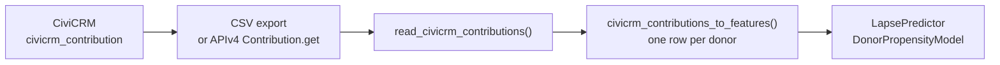

# Ingest CiviCRM contributions

[CiviCRM](https://civicrm.org) is the CRM most small and mid-sized nonprofits actually run, and its `civicrm_contribution` table is where their giving history lives. `philanthropy.ingest` turns a contribution export into the donor-level feature table the estimators expect, no glue code, and without the two mistakes a bare `pd.read_csv` makes.



## Both spellings of the same table

CiviCRM names its fields twice. A CSV export writes human labels: `Contact ID`, `Total Amount`, `Contribution Date`. APIv4 returns the underlying database columns: `contact_id`, `total_amount`, `receive_date`. The bridge normalises headers to the APIv4 name, so a hand-run export and a scripted API pull take the same path and produce the same frame.

```python
from pathlib import Path

import pandas as pd

from philanthropy.ingest import (
    civicrm_contributions_to_features,
    read_civicrm_contributions,
)

# Stand in for a CiviCRM "Export Contributions" CSV.
export = Path("civicrm_export.csv")
export.write_text(
    "Contribution ID,Contact ID,Contribution Date,Total Amount,Currency,"
    "Contribution Status,Financial Type,Test Mode,Email\n"
    "1,101,2025-01-15,250.00,USD,Completed,Donation,0,ada@uni.edu\n"
    "2,101,2025-06-01,1000.00,USD,Completed,Member Dues,0,ada@uni.edu\n"
    "3,101,2025-06-05,99.00,USD,Failed,Donation,0,ada@uni.edu\n"
    "4,202,2025-03-01,5000.00,USD,Completed,Donation,1,grace@uni.edu\n"
    "5,202,2025-04-10,750.00,USD,Completed,Donation,0,grace@uni.edu\n"
)

contributions = read_civicrm_contributions(export)
print(sorted(contributions.columns))
```

`read_civicrm_contributions` also accepts a **directory**, walked recursively: the shape you get from keeping a folder of monthly exports. Files are concatenated in sorted relative-path order, symlinks are not followed, and an Excel byte-order mark on the first header is stripped.

Reading is deliberately lossless: every row arrives as text, and nothing is filtered. Policy lives in the aggregation step, so the raw export stays inspectable.

## Two things a bare `read_csv` gets wrong

```python
features = civicrm_contributions_to_features(
    contributions, reference_date="2025-07-01"
)
print(features[["total_gift_amount", "gift_count", "largest_gift_amount"]])

# Row 3 is Failed and row 4 is a payment-processor test transaction.
assert float(features.loc["101", "total_gift_amount"]) == 1250.0   # not 1349
assert float(features.loc["202", "total_gift_amount"]) == 750.0    # not 5750
```

**Test-mode rows are real rows.** CiviCRM writes payment-processor test transactions into the same table, flagged `is_test` / `Test Mode`. They are always dropped; that is money nobody gave.

**A contribution is not a payment.** `contribution_status` separates `Completed` from `Pending`, `Failed`, `Refunded`, `Cancelled` and `Chargeback`. Only `Completed` is counted by default. Widen it when you mean to:

```python
with_pledges = civicrm_contributions_to_features(
    contributions, reference_date="2025-07-01", statuses=("Completed", "Pending")
)
everything = civicrm_contributions_to_features(
    contributions, reference_date="2025-07-01", statuses=None
)
assert float(everything.loc["101", "total_gift_amount"]) == 1349.0
```

If you ask for a status filter and the export has no `Contribution Status` column, the bridge raises a `UserWarning` rather than silently counting refunds. Add the field to your export mapping, or pass `statuses=None` to say you meant it.

## The output is already an RFM table

One row per donor, indexed by `contact_id`:

| Column | Built from |
|---|---|
| `constituent_email`, `first_name`, `last_name` | identity fields, carried through when present |
| `total_gift_amount`, `gift_count`, `largest_gift_amount` | counted contributions |
| `first_gift_date`, `last_gift_date` | earliest / latest counted contribution |
| `years_active`, `recency_days` | first / last gift vs. the reference date |
| `distinct_financial_types` | breadth across Donation, Member Dues, Event Fee, … |

`recency_days`, `gift_count` and `total_gift_amount` are the R, F and M of an RFM model, so you do not need `RFMTransformer` on top of this; it is already aggregated.

**Leakage-safe.** Recency is anchored to the `reference_date` you pass, or to the latest gift in the batch, never to a moving "now". Pass it explicitly whenever you are rebuilding a historical training set, or a rerun next month silently produces different features.

**Replay-safe.** Two rows sharing a CiviCRM `Contribution ID` are the same contribution, and overlapping monthly exports are how that happens. They are collapsed, so a re-read does not double-count a gift.

```python
replayed = pd.concat([contributions, contributions], ignore_index=True)
doubled = civicrm_contributions_to_features(replayed, reference_date="2025-07-01")
assert doubled["total_gift_amount"].equals(features["total_gift_amount"])
print("dedup by Contribution ID holds")
```

## Score the result

Train on your labelled giving history; here the synthetic generator stands in for it.

```python
import numpy as np

from philanthropy.datasets import generate_synthetic_donor_data
from philanthropy.models import DonorPropensityModel

history = generate_synthetic_donor_data(n_samples=400, random_state=0)
model = DonorPropensityModel(n_estimators=50, random_state=0).fit(
    history[["total_gift_amount", "years_active", "event_attendance_count"]].to_numpy(),
    history["is_major_donor"].to_numpy(),
)

# gift_count stands in for the engagement-count feature; a contribution export
# carries no event attendance.
cols = ["total_gift_amount", "years_active", "gift_count"]
features["affinity_score"] = model.predict_affinity_score(features[cols].to_numpy())
print(features["affinity_score"].round(1))

assert np.isfinite(features["affinity_score"]).all()
```

Pair the export with an event or engagement feed if you want a real `event_attendance_count`; [Ingest UniSchema events](ingest_unischema_events.md) covers that side.

## Amounts, dates and currencies

`total_amount` is parsed after stripping currency symbols and grouping separators, so an Excel-formatted `$1,250.00` survives the round trip. That assumes `.` is the decimal point; a site exporting `1.250,00` should normalise upstream.

`receive_date` is parsed as a mixed format, because a CSV export writes dates in the site's configured format rather than CiviCRM's stored `YYYY-MM-DD HH:MM:SS`. Ambiguous values resolve month-first (`03/01/2025` is 1 March), so a site configured `dd/mm/yyyy` should hand in an already-parsed datetime column.

`total_gift_amount` is a plain sum. CiviCRM carries a per-row `currency` but the export has no FX rates, so a mixed-currency batch emits a `UserWarning` rather than adding apples to oranges. Normalise upstream if your feed is multi-currency.
