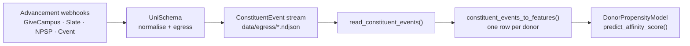

# Ingest UniSchema events

[UniSchema](https://github.com/PhilanthroPy-Project/UniSchema) normalises fragmented advancement webhooks — GiveCampus, Slate, NPSP, Cvent — into a single `ConstituentEvent` stream. `philanthropy.ingest` turns that stream into the donor-level feature table the estimators expect, with no glue code between the two projects.



## Read whatever the egress wrote

`read_constituent_events` handles the three shapes UniSchema produces:

* a single `.json` file holding one event (object) or many (array);
* a `.ndjson` / `.jsonl` batch, one event per line;
* a **directory**, walked recursively — UniSchema's local egress is date-partitioned as `{prefix}/{vendor}/{yyyy}/{mm}/{dd}/{eventId}.json`, so a non-recursive scan of the top directory finds nothing. `*.manifest.json` batch sidecars are skipped, and symlinks are not followed.

A missing path raises `FileNotFoundError`; a malformed record raises `ValueError` naming the file and line.

```python
import json
from pathlib import Path

from philanthropy.ingest import constituent_events_to_features, read_constituent_events

# Stand in for UniSchema's date-partitioned egress tree.
egress = Path("data/egress/givecampus/2025/03/01")
egress.mkdir(parents=True, exist_ok=True)

events = [
    {"eventId": "e1", "constituentEmail": "ada@uni.edu", "eventType": "DONATION",
     "sourceSystem": "GIVECAMPUS", "amount": 250.0,
     "createdAt": "2025-03-01T12:00:00Z"},
    {"eventId": "e2", "constituentEmail": "ada@uni.edu",
     "eventType": "EVENT_REGISTRATION", "sourceSystem": "CVENT",
     "createdAt": "2025-06-01T09:00:00Z"},
    {"eventId": "e3", "constituentEmail": "grace@uni.edu", "eventType": "DONATION",
     "sourceSystem": "SLATE", "amount": 5000.0,
     "createdAt": "2025-02-14T08:30:00Z"},
]
(egress / "batch.ndjson").write_text("\n".join(json.dumps(e) for e in events))

loaded = read_constituent_events("data/egress")
print(len(loaded))
```

## Aggregate to one row per donor

```python
features = constituent_events_to_features(loaded, reference_date="2025-07-01")
print(features[["total_gift_amount", "gift_count", "event_attendance_count"]])
print(features.index.name)
```

The index is `constituent_id` — the external CRM id when the event carries a non-empty `externalConstituentId`, else the email. Columns:

| Column | Built from |
|---|---|
| `constituent_email`, `first_name`, `last_name` | identity fields, carried through when present |
| `total_gift_amount`, `gift_count`, `first_gift_date`, `last_gift_date` | `DONATION` events |
| `event_attendance_count` | `EVENT_REGISTRATION` events |
| `email_click_count` | `EMAIL_CLICK` events |
| `years_active`, `recency_days` | first / last event vs. the reference date |
| `distinct_source_systems` | channel breadth |

## Two guarantees worth relying on

**Leakage-safe.** Recency is anchored to the `reference_date` you pass, or to the batch's latest event — never to a moving "now". Pass it explicitly whenever you are rebuilding a historical training set, or a rerun next month silently produces different features.

**At-least-once-safe.** Webhooks redeliver. Events are deduplicated by `eventId`, so a replayed batch does not double-count a gift.

```python
replayed = loaded + loaded            # every webhook delivered twice
once = constituent_events_to_features(loaded, reference_date="2025-07-01")
twice = constituent_events_to_features(replayed, reference_date="2025-07-01")

assert twice["total_gift_amount"].equals(once["total_gift_amount"])
assert twice["gift_count"].equals(once["gift_count"])
print("dedup by eventId holds")
```

Events without an `eventId` are kept as distinct records — dropping them would lose real gifts from feeds that do not emit one.

## Score the result

The feature frame feeds the estimators directly. Train on your labelled giving history; here the synthetic generator stands in for it.

```python
import numpy as np

from philanthropy.datasets import generate_synthetic_donor_data
from philanthropy.models import DonorPropensityModel

cols = ["total_gift_amount", "years_active", "event_attendance_count"]

history = generate_synthetic_donor_data(n_samples=400, random_state=0)
model = DonorPropensityModel(n_estimators=50, random_state=0).fit(
    history[cols].to_numpy(), history["is_major_donor"].to_numpy()
)

features["affinity_score"] = model.predict_affinity_score(features[cols].to_numpy())
print(features["affinity_score"].round(1))

assert np.isfinite(features["affinity_score"]).all()
```

A runnable end-to-end version lives in [`examples/unischema_to_scores.py`](https://github.com/PhilanthroPy-Project/PhilanthroPy/blob/main/examples/unischema_to_scores.py).

## Mixed currencies

`total_gift_amount` is a plain sum. `ConstituentEvent` carries a per-event `currency` but no FX rates, so a mixed-currency feed would add apples to oranges. Rather than convert (impossible without rates) or crash, the bridge emits a `UserWarning`. Normalise upstream if your feed is multi-currency.
