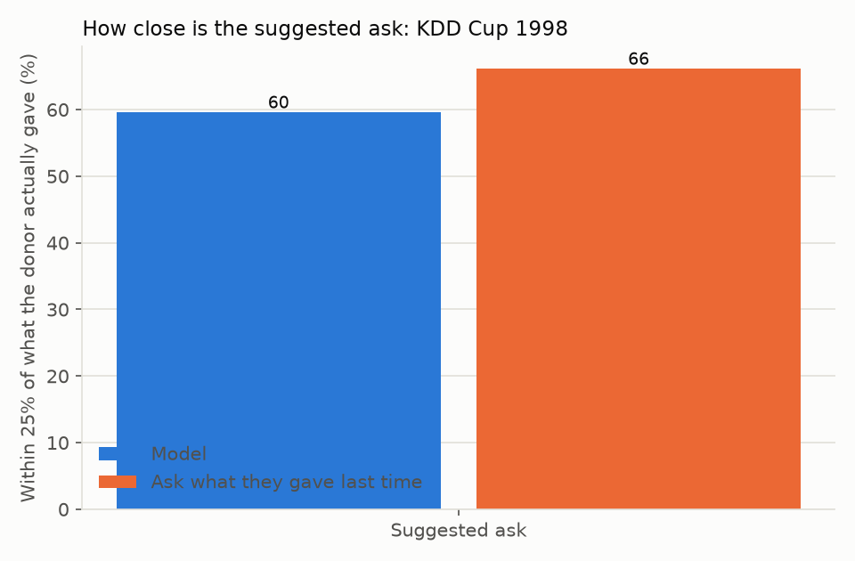

# Suggested ask

Featured on a real donor file: [KDD Cup 1998](https://kdd.ics.uci.edu/databases/kddcup98/kddcup98.html).
We pretended it was 1 June 1997 and asked the model to suggest an amount for
each donor who went on to give.

Of every 100 suggested amounts, 60 landed within 25% of what the donor
actually gave. Simply asking for what they gave last time landed within 25%
for 66 out of every 100.

**Does not beat the simple rule; use the rule instead.** On this file, asking
a donor for what they gave last time is a better guess than the model's
suggestion.

## Which data

Real file: [KDD Cup 1998](https://kdd.ics.uci.edu/databases/kddcup98/kddcup98.html).
On our sample (synthetic) donor panel the model did beat "ask what they gave
last time" (about 20 in 100 within 25%, versus about 10 in 100 for the simple
rule), so the answer is not the same on every file. Results on your own data
will differ from both.
