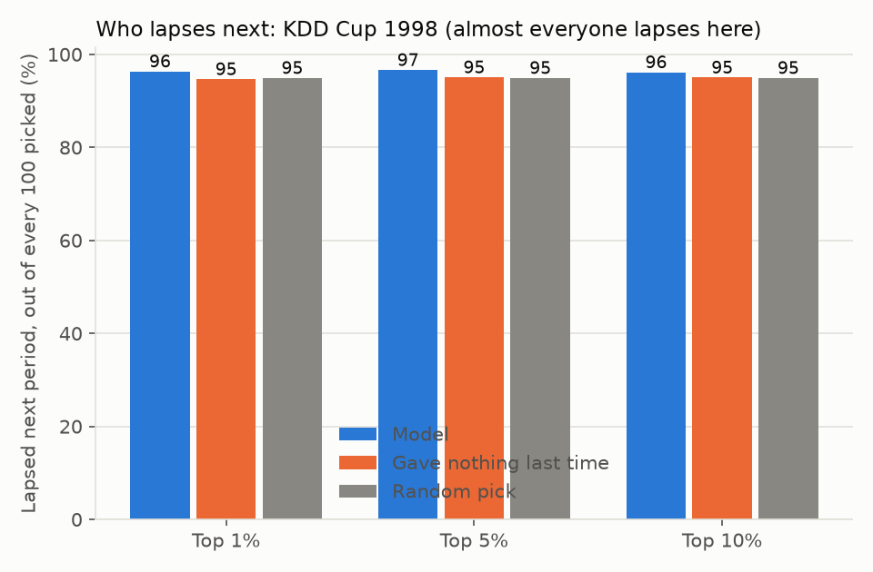

# Lapse

Featured on a real donor file: [KDD Cup 1998](https://kdd.ics.uci.edu/databases/kddcup98/kddcup98.html).
We pretended it was 1 June 1997, the date of that program's own held-out
mailing, and checked who gave nothing to it.

Almost everyone in this file was already about to lapse: about 95 out of
every 100 donors gave nothing to the next mailing, whether you pick with a
model or not. Of our top 10% of picks, 96 out of every 100 lapsed. Picking
"whoever gave nothing last time" found 95 out of every 100. Picking at random
also finds about 95 out of every 100.

**About the same as random picks.** When almost every donor is a lapse risk,
telling them apart barely matters; do not expect a lapse model to sharpen your
list much on a file shaped like this one.

## Which data

Real file: [KDD Cup 1998](https://kdd.ics.uci.edu/databases/kddcup98/kddcup98.html),
where lapsing is close to universal. On our sample (synthetic) donor panel,
where lapsing is a genuine minority outcome, the model came out about the same
as the simple rule ("gave nothing last period") rather than the same as
random. Results on your own file will differ from both.
