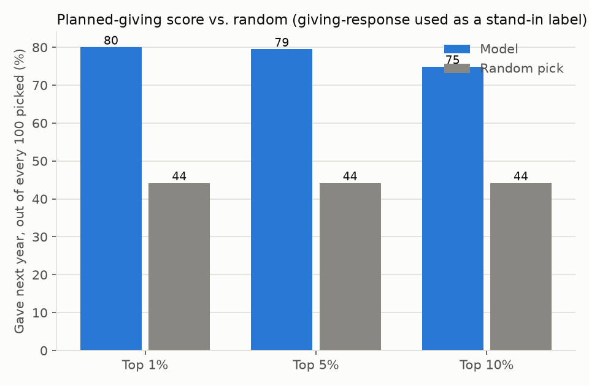

# Planned giving

We pretended it was 30 June 2022: the model only saw gifts up to that date,
then we checked which donors actually gave again in fiscal year 2023. Our
sample data has no real bequest-intent label to test against (no fundraising
file we ship does), so this checks the next best thing: does the score beat
random guessing on a related outcome? There is also no established simple
rule for planned-giving prospects to compare against, the way "rank by giving
so far" exists for major gifts.

Of our top 10% of picks, 75 out of every 100 gave again next year. Picking at
random finds about 44 out of every 100.

**Beats random picking.** Treat this as "the score separates donors better
than chance," not as a validated bequest-intent measurement.

## Which data

Sample (synthetic) donor panel, five random draws averaged; no real
planned-giving data was used. Results on your own bequest data will differ.
