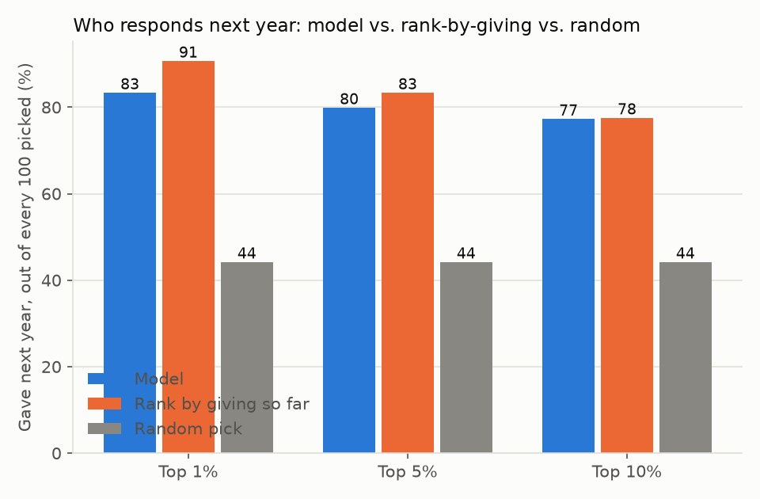

# Response (will they give again?)

We pretended it was 30 June 2022: the model only saw gifts up to that date,
then we checked which donors actually gave again in fiscal year 2023 (1 July
2022 to 30 June 2023).

Of our top 5% of picks, 80 out of every 100 gave again. Ranking by total
giving so far found 83 out of every 100. Picking at random finds about 44 out
of every 100.

**Does not beat the simple rule; use the rule instead.** Ranking donors by
their own giving history does at least as well as the model at every pick
size we checked.

## Which data

Sample (synthetic) donor panel, five random draws averaged. On the real
public file, [KDD Cup 1998](https://kdd.ics.uci.edu/databases/kddcup98/kddcup98.html),
the model did beat its comparison rule (ranking by lifetime giving alone),
so which one wins can depend on your data; results on your own file will
differ from both of these.
