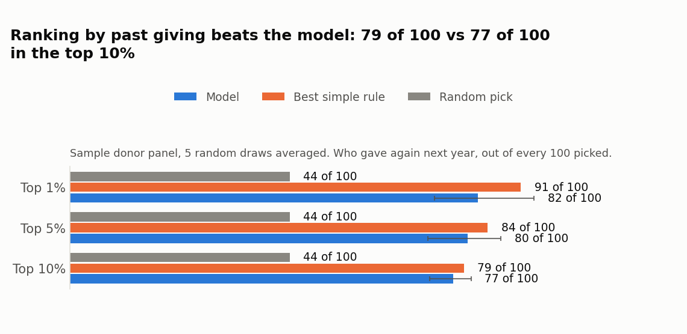

# Response (will they give again?)

We pretended it was 30 June 2022: the model only saw gifts up to that date,
then we checked which donors actually gave again in fiscal year 2023 (1 July
2022 to 30 June 2023).

Of our top 5% of picks, 80 out of every 100 gave again. The best simple rule
we compare against here (ranking by lifetime giving, or an RFM cell score
combining recency, frequency and monetary value, whichever does better on
each draw) found 84 out of every 100. Picking at random finds about 44 out
of every 100.

**On our sample data, does not beat the simple rule.** Ranking donors by
their own giving history does at least as well as the model at every pick
size we checked. On a real donor file it does beat the rule for the top
picks; see below.

## Which data

Sample (synthetic) donor panel, five random draws averaged. Our sample data
is built so that giving again follows past giving almost exactly, which is
why no model can beat ranking by past giving on it.

On a real public file, [KDD Cup 1998](https://kdd.ics.uci.edu/databases/kddcup98/kddcup98.html),
the picture is different. We pretended it was 1 June 1997 and checked who
gave to that program's next mailing. Only about 5 out of every 100 donors
did, so random picks find about 5 in 100. The comparison rule is the best of
lifetime giving, an RFM cell score, and the file's own RFA_2 segment
(how often the donor gave recently, then their last gift).

- On a held-out 30% of the file, the model's top 1% found 10 in 100 and its
  top 5% found 10 in 100, against 7 and 8 in 100 for the best rule. At the
  top 10% it was about the same as the rule (9 in 100 against 8).
- On a second file from the same program that the model never saw at all
  (`cup98VAL`, 96,367 donors), its top 1% found 12 in 100 and its top 10%
  found 9 in 100, against 9 and 7 in 100 for the best rule.

So on this real file the model beats the rule for your top picks, and which
one wins can depend on your data; results on your own file will differ from
both of these.
