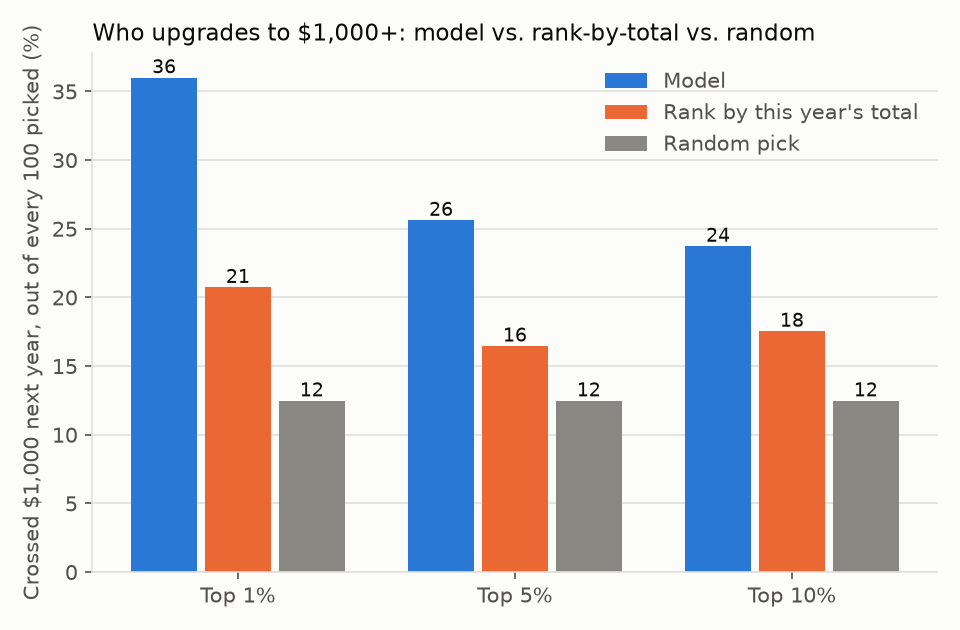
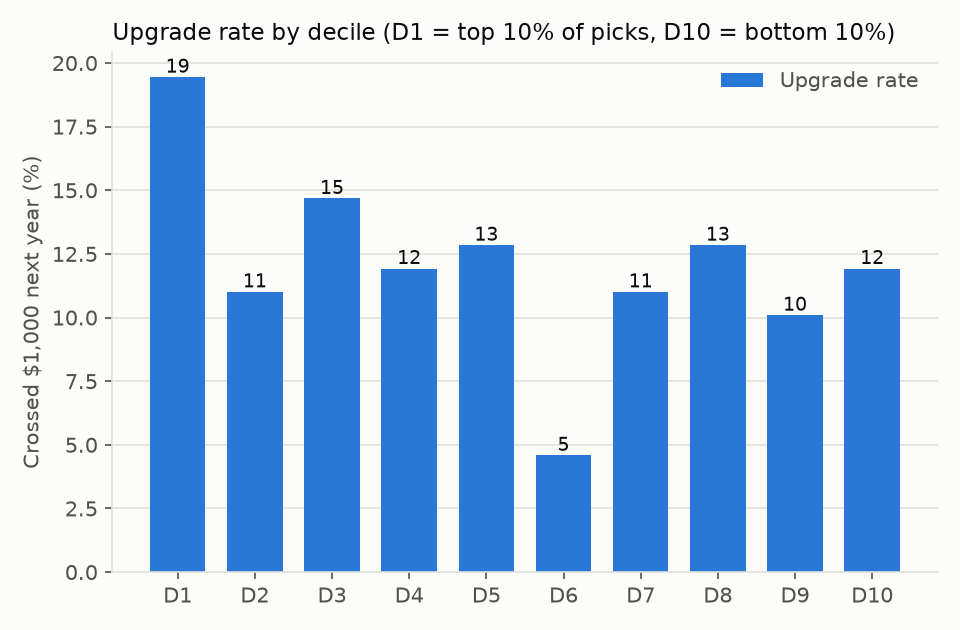

# $1K upgrade

We pretended it was 30 June 2021: the model only saw gifts up to that date,
then we checked what mid-level donors actually did in fiscal year 2022 (1 July
2021 to 30 June 2022) &mdash; specifically, which of them crossed $1,000 for
the first time.

Of our top 10% of picks, 24 out of every 100 crossed $1,000. Ranking by this
year's giving total alone found 17 out of every 100. Picking at random finds
about 12 out of every 100.

**Beats the simple rule.**

## Worked example

Run `score_upgrade_prospects` on a sample donor panel
(`make_donor_panel(random_state=0)`), cutting off at 30 June 2021 and checking
fiscal year 2022. Out of 1,089 mid-level donors held out for validation, the
model's top 109 picks (its top 10%) included 21 who actually upgraded.
Ranking those same 1,089 donors by this year's total giving instead would have
found 14. Picking 109 of them at random would find about 13.

The chart below breaks the same validation fold into ten equal-sized groups by
model score (D1 = the 10% the model liked most, D10 = the 10% it liked least),
so you can see the ranking is not just a top-vs-bottom effect:

## Which data

Sample (synthetic) donor panel, five random draws averaged. We do not show a
$1,000-upgrade result on KDD Cup 1998: that file's test year has almost no
qualifying gifts to check against, so any number there would be noise, not a
result. Results on your own file will differ from both.
