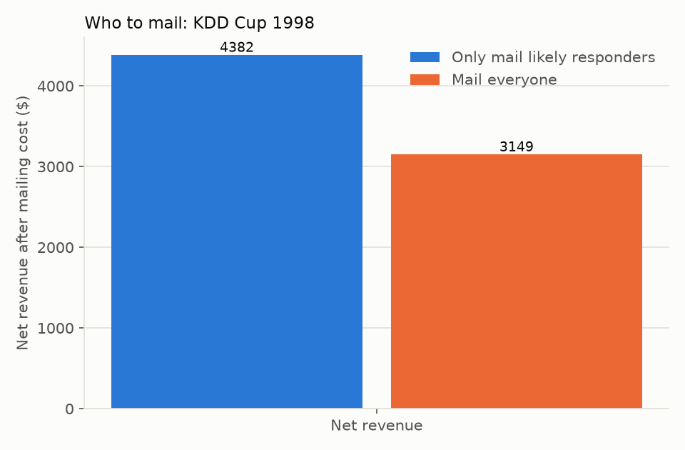

# Who to mail

Featured on a real donor file: [KDD Cup 1998](https://kdd.ics.uci.edu/databases/kddcup98/kddcup98.html).
We pretended it was 1 June 1997 and asked: for each donor, is a $0.68 mailing
worth sending, or should we skip it?

We mailed 18,588 of the 28,624 donors held out for this test, only the ones
where the model expected the gift to beat the mailing cost. That brought in
$4,382 after mailing costs. Mailing all 28,624 of them would have brought in
$3,149 after costs.

**Beats mailing everyone.** Skipping the donors least likely to respond raised
more money net, not less, even though fewer pieces went out.

## Which data

Real file: [KDD Cup 1998](https://kdd.ics.uci.edu/databases/kddcup98/kddcup98.html),
a 1990s direct-mail history; gift sizes there are small (a few dollars to a
few hundred), so its dollar figures will not resemble a major-gift program.
Results on your own file, and at your own mailing cost, will differ.
