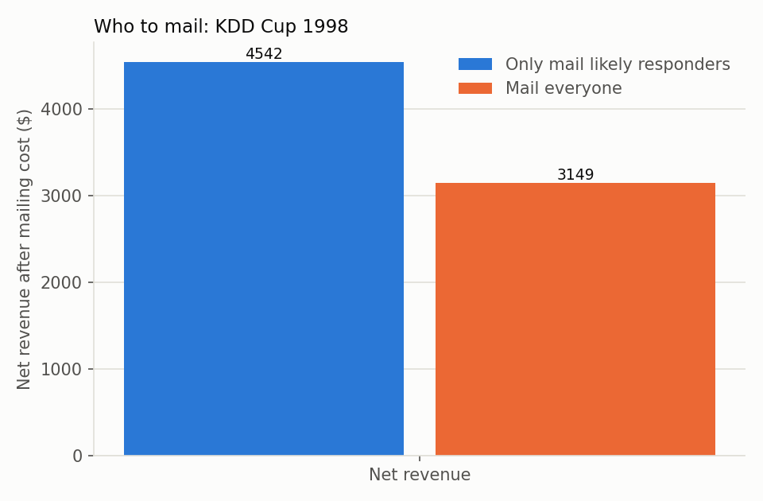
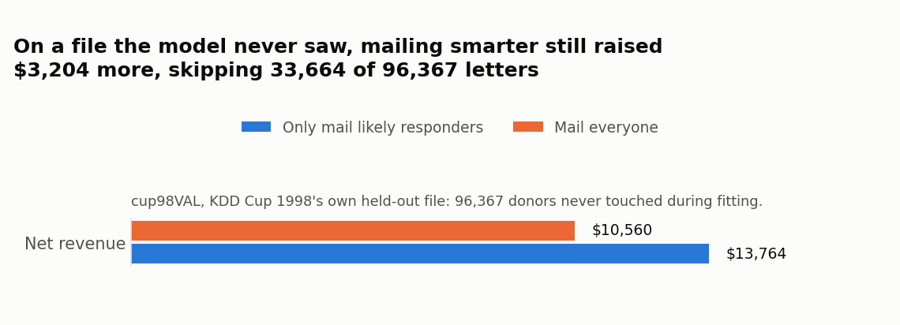

# Who to mail

Featured on a real donor file: [KDD Cup 1998](https://kdd.ics.uci.edu/databases/kddcup98/kddcup98.html).
We pretended it was 1 June 1997 and asked: for each donor, is a $0.68 mailing
worth sending, or should we skip it?

We mailed 18,704 of the 28,624 donors held out for this test, only the ones
where the model expected the gift to beat the mailing cost. That brought in
$4,542 after mailing costs. Mailing all 28,624 of them would have brought in
$3,149 after costs.

**Beats mailing everyone.** Skipping the donors least likely to respond raised
more money net, not less, even though fewer pieces went out.

**Checked again on a file the model never saw at all.** The number above
scores a random 30% slice of the same file the model was fit on. KDD Cup
1998 also released a second, entirely separate file for exactly this
purpose: `cup98VAL`, 96,367 more donors, with its answer key (`valtargt`)
withheld until after the original competition and never touched during
fitting or the 55/15/30 split above. Scored on that file with the same
$0.68 rule: mailing the 62,703 of 96,367 donors the model expected to be
worth it brought in $13,764 after costs, against $10,560 for mailing
everyone. Same shape as the number above, on a file the model has never
seen in any capacity.

## Which data

Real file: [KDD Cup 1998](https://kdd.ics.uci.edu/databases/kddcup98/kddcup98.html),
a 1990s direct-mail history; gift sizes there are small (a few dollars to a
few hundred), so its dollar figures will not resemble a major-gift program.
Results on your own file, and at your own mailing cost, will differ.
